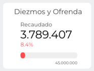
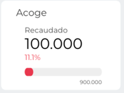
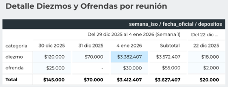
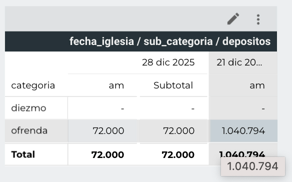

# 📊 Documentación Dashboard – Looker Studio

Este documento describe los gráficos presentes en el dashboard de Finanzas Iglesia la Viña, cuya fuente de datos corresponde a una planilla en **Google Sheets**. El objetivo es dejar claridad sobre el propósito, origen de datos, métricas y lógica de cada visualización.
---

## 🗂️ Información General

* **Herramienta:** Looker Studio
* **Fuente de datos:** Google Sheets
* **Responsable:** Franco Chamorro
* **Última actualización:** 16-01-2026

---

## 🧩 Estructura del Dashboard

El dashboard se compone de los siguientes gráficos:

Gráfico 1 – *Recaudación total por concepto de "DIEZMO Y OFRENDA"*

Gráfico 2 – *Recaudación total por concepto de "EDUCA MONTEALTO"*

Gráfico 3 – *Recaudación total por concepto de "CENTRO MEDICO"*

Gráfico 4 – *Recaudación total por concepto de "ACOGE"*

Gráfico 5 – *Detalle por mes de "DIEZMO Y OFRENDA", "EDUCA MONTEALTO", "CENTRO MEDICO" y "ACOGE"*

Gráfico 6 – *Detalle por mes y semana de "DIEZMO Y OFRENDA"*

Gráfico 7 – *Detalle "DIEZMO Y OFRENDA" por reunión*

Gráfico 8 – *Detalle "DIEZMO Y OFRENDA" por concepto horario (AM/PM)*

Gráfico 9 – *Detalle "DIEZMO Y OFRENDA" por mes*

Gráfico 10 – *Recaudación total "DIEZMO Y OFRENDA": Actual vs Año Pasado*

Gráfico 11 – *Recaudación Total "DIEZMO Y OFRENDA": Mes y Semana*

---

## 📈 Gráfico 1 – *Recaudación total por concepto de "DIEZMO Y OFRENDA"*

### 🎯 Objetivo

*Este gráfico tiene como objetivo mostrar el total recaudado por concepto de diezmo y ofrenda durante el mes en curso, junto con el porcentaje de cumplimiento de la meta mensual, establecida por el pastor para dicho concepto. Permite visualizar de forma clara tanto el monto total recaudado en el mes como el nivel de avance respecto a la meta definida.* 

### 📊 Tipo de visualización

* *MEDIDOR*

### 🗃️ Fuente de datos

* Google Sheets: *Planilla Finanzas*

### 📐 Dimensiones

* *Categoría: DIEZMO;OFRENDA*
* *Organización: Organización Social la Viña*

### 🎛️ Filtros aplicados

* *Segmentador de tiempo externo*

### 📝 Observaciones

* *Meta es ingresada manualmente por el equipo de finanzas*

---

## 📈 Gráfico 2 – *Recaudación total por concepto de "EDUCA MONTEALTO"*

### 🎯 Objetivo

*Este grafico tiene como objetivo mostrar el total recaudado por concepto de "EDUCA MONTEALTO" (COLEGIO) durante el mes en curso, junto con el porcentaje de cumplimiento de la meta mensual, establecida por el pastor para dicho concepto. Permite visualizar de forma clara tanto el monto total recaudado en el mes como el nivel de avance respecto a la meta definida*

### 📊 Tipo de visualización

* *MEDIDOR*

### 🗃️ Fuente de datos

* *Google Sheets: *Planilla Finanzas*

### 📐 Dimensiones

* *Categoría: EDUCA MONTEALTO*
* *Organización: Organización Social la Viña*

### 🎛️ Filtros aplicados

* *Segmentador de tiempo externo*

### 📝 Observaciones

* *Meta es ingresada manualmente por el equipo de finanzas*
  
---

## 📈 Gráfico 3 – *Recaudación total por concepto de "CENTRO MEDICO"*

### 🎯 Objetivo

*Este grafico tiene como objetivo mostrar el total recaudado por concepto de "CENTRO MEDICO" durante el mes en curso, junto con el porcentaje de cumplimiento de la meta mensual, establecida por el pastor para dicho concepto. Permite visualizar de forma clara tanto el monto total recaudado en el mes como el nivel de avance respecto a la meta definida*

### 📊 Tipo de visualización

* *MEDIDOR*

### 🗃️ Fuente de datos

* *Google Sheets: *Planilla Finanzas*

### 📐 Dimensiones

* *Categoría: CENTRO MEDICO*
* *Organización: Organización Social la Viña*

### 🎛️ Filtros aplicados

* *Segmentador de tiempo externo*

### 📝 Observaciones

* *Meta es ingresada manualmente por el equipo de finanzas*

---

## 📈 Gráfico 4 – *Recaudación total por concepto de "ACOGE"*

### 🎯 Objetivo

*Este grafico tiene como objetivo mostrar el total recaudado por concepto de "ACOGE" durante el mes en curso, junto con el porcentaje de cumplimiento de la meta mensual, establecida por el pastor para dicho concepto. Permite visualizar de forma clara tanto el monto total recaudado en el mes como el nivel de avance respecto a la meta definida*

### 📊 Tipo de visualización

* *MEDIDOR*

### 🗃️ Fuente de datos

* *Google Sheets: *Planilla Finanzas*

### 📐 Dimensiones

* *Categoría: CENTRO MEDICO*
* *Organización: Organización Social la Viña*

### 🎛️ Filtros aplicados

* *Segmentador de tiempo externo*

### 📝 Observaciones

* *Meta es ingresada manualmente por el equipo de finanzas*

---

## 📈 Gráfico 5 – *Detalle por mes de "DIEZMO Y OFRENDA", "EDUCA MONTEALTO", "CENTRO MEDICO" y "ACOGE"*

### 🎯 Objetivo

*Este gráfico tiene como objetivo visualizar de forma clara qué categoría presenta la mayor y la menor recaudación por mes, así como el total recaudado mensual de las cuatro categorías. Además, permite analizar el comportamiento mensual de cada categoría, facilitando la identificación de aquellas que aportan mayor recaudación y las que contribuyen en menor medida.*

### 📊 Tipo de visualización

* *TABLA*

### 🗃️ Fuente de datos

* *Google Sheets: *Planilla Finanzas*

### 📐 Dimensiones

* *Categoría: DIEZMO, OFRENDA, MONTE ALTO, CENTRO MEDICO, ACOGE, FECHA*
* *Organización: Organización Social la Viña*

### 🎛️ Filtros aplicados

* *No Aplica*

### 📝 Observaciones

* *No resulta sencillo determinar si existieron variaciones positivas o negativas entre las distintas categorías en cada mes.*
* *Gráfico ordenado de forma descendente*
* *Gráfico con filas totales*

---

## 📈 Gráfico 6 – *Detalle por mes y semana de "DIEZMO Y OFRENDA"*

### 🎯 Objetivo

*Este gráfico tiene como objetivo detallar la categoría Diezmo y Ofrenda, mostrando la recaudación total de ambas por mes y por semana. Se utilizan tonos de azul para destacar los valores, donde el azul oscuro indica la semana con mayor recaudación y el azul claro la semana con menor recaudación.  Permite identificar con claridad cuáles fueron las semanas de mayor y menor recaudación en cada mes.*

### 📊 Tipo de visualización

* *TABLA*

### 🗃️ Fuente de datos

* *Google Sheets: *Planilla Finanzas*

### 📐 Dimensiones

* *Categoría: DIEZMO, OFRENDA, FECHA*
* *Organización: Organización Social la Viña*

### 🎛️ Filtros aplicados

* *No Aplica*

### 📝 Observaciones

* *Se modificará la paleta de colores para mejorar la interpretación visual del gráfico, utilizando el color verde para representar la mayor recaudación semanal dentro del mes y el color rojo para la menor recaudación del mismo período, ya que los tonos azul y azul claro no resultaban lo suficientemente representativos.*

---

## 📈 Gráfico 7 – *Detalle "DIEZMO Y OFRENDA" por reunión*

### 🎯 Objetivo

*Este gráfico tiene como objetivo mostrar la recaudación por concepto de diezmo y ofrenda de manera separada, individualizando cada una de las categorías mencionadas. Además, entrega una visualización clara de lo recaudado por día de reunión, los cuales suelen ser miércoles y domingo.
Por lo mismo, es posible identificar la semana del mes (1, 2, 3, 4, 5 o 6), el día de la reunión y el subtotal correspondiente a cada semana, facilitando el análisis del comportamiento de la recaudación en el tiempo.*

### 📊 Tipo de visualización

* *TABLA*

### 🗃️ Fuente de datos

* *Google Sheets: *Planilla Finanzas*

### 📐 Dimensiones

* *Categoría: DIEZMO, OFRENDA, FECHA*
* *Organización: Organización Social la Viña*

### 🎛️ Filtros aplicados

* *No Aplica*

### 📝 Observaciones

* *Sin Observaciones*

---

## 📈 Gráfico 8 – *Detalle "DIEZMO Y OFRENDA" por concepto horario (AM/PM)*

### 🎯 Objetivo

*Este gráfico tiene como objetivo mostrar la recaudación por concepto de diezmo y ofrenda de manera separada, individualizando cada una de las categorías mencionadas. Además, entrega una visualización clara de lo recaudado por día de reunión.

Asimismo, las reuniones se individualizan según el horario, diferenciando entre AM (mañana) y PM (tarde). Esto permite visualizar la recaudación correspondiente a cada reunión, ya sea en horario AM o PM, junto con el subtotal, tanto para el concepto de diezmo como de ofrenda.*

### 📊 Tipo de visualización

* *TABLA*

### 🗃️ Fuente de datos

* *Google Sheets: *Planilla Finanzas*

### 📐 Dimensiones

* *Categoría: DIEZMO, OFRENDA, FECHA, AM/PM*
* *Organización: Organización Social la Viña*

### 🎛️ Filtros aplicados

* *No Aplica*

### 📝 Observaciones

* *El total por reunión resulta redundante, ya que esta información puede visualizarse en el Gráfico 7.*

---

## 📈 Gráfico 9 – *Detalle "DIEZMO Y OFRENDA" por mes*

### 🎯 Objetivo

*Este gráfico tiene como objetivo mostrar la recaudación por concepto de diezmo y ofrenda de manera separada por mes, individualizando ambas categorías y representándolas mediante un gráfico de columnas apiladas. Este tipo de visualización permite identificar de forma clara y visual cuál de las dos categorías presenta mayor recaudación en cada mes.

Además, cada mes se presenta acompañado del año correspondiente y de la meta mensual, la cual es asignada por el pastor y considera el total conjunto de ambas categorías. Por lo mismo, el gráfico permite evaluar de manera rápida y sencilla si el mes analizado superó o no la meta establecida, así como identificar qué categoría aportó en mayor medida al cumplimiento de dicha meta.*

### 📊 Tipo de visualización

* *GRAFICO DE COLUMNAS APILADAS*

### 🗃️ Fuente de datos

* *Google Sheets: *Planilla Finanzas*

### 📐 Dimensiones

* *Categoría: DIEZMO, OFRENDA, FECHA*
* *Organización: Organización Social la Viña*

### 🎛️ Filtros aplicados

* *No Aplica*

### 📝 Observaciones

* *La meta de recaudación por concepto de diezmo y ofrenda corresponde a una meta genérica definida para el mes en cuestión, por lo que no necesariamente es adecuada para comparar con otros meses. Por lo mismo, su evaluación debe realizarse de manera individual para cada mes analizado.*

---

## 📈 Gráfico 10 – *Recaudación total "DIEZMO Y OFRENDA": Actual vs Año Pasado*

### 🎯 Objetivo

*Este gráfico tiene como objetivo mostrar la recaudación por concepto de ofrenda y diezmo del mes y año actual en comparación con el mismo mes y año anterior. Permite visualizar de manera clara cómo se ha comportado la recaudación a lo largo del tiempo y determinar si esta fue mayor o menor respecto al mes y año de referencia.*

### 📊 Tipo de visualización

* *GRAFICO DE LINEAS*

### 🗃️ Fuente de datos

* *Google Sheets: *Planilla Finanzas*

### 📐 Dimensiones

* *Categoría: DIEZMO, OFRENDA, FECHA, AÑO_AMTERIOR*
* *Organización: Organización Social la Viña*

### 🎛️ Filtros aplicados

* *No Aplica*

### 📝 Observaciones

* *La paleta de colores actual no permite distinguir con claridad entre los datos del período pasado y el período presente, por lo que se recomienda modificar los colores para mejorar la diferenciación visual.*

* *Cada punto del gráfico de líneas muestra etiquetas de datos, lo cual resulta innecesario, ya que el usuario puede acceder a esta información al interactuar con el punto. Se recomienda eliminar dichas etiquetas para reducir la sobrecarga visual.*

* *Se recomienda incorporar un indicador visual en verde o rojo: rojo cuando la recaudación del año pasado sea mayor que la del año actual (comparación mensual), y verde en el caso contrario, con el fin de lograr una visualización más clara e intuitiva.*

* *Se sugiere agregar una línea de tendencia de la recaudación, pero en un gráfico adicional, ya que el actual se encuentra visualmente muy cargado.*

---

## 📈 Gráfico 11 – *Recaudación Total "DIEZMO Y OFRENDA": Mes y Semana*

### 🎯 Objetivo

*Este gráfico tiene como objetivo mostrar la recaudación total por concepto de diezmo y ofrenda, distribuida por semana y asignando un color distintivo a cada una de ellas. Al tratarse de un gráfico de columnas agrupadas, cada columna corresponde al mes y año en cuestión, lo que permite comparar de manera clara la distribución semanal de la recaudación dentro de cada período.*

### 📊 Tipo de visualización

* *GRAFICO DE COLUMNAS APILADAS*

### 🗃️ Fuente de datos

* *Google Sheets: *Planilla Finanzas*

### 📐 Dimensiones

* *Categoría: DIEZMO, OFRENDA, FECHA*
* *Organización: Organización Social la Viña*

### 🎛️ Filtros aplicados

* *No Aplica*

### 📝 Observaciones

* *Este gráfico resulta redundante, ya que existe una tabla que permite visualizar la recaudación total distribuida por semana, mes y año. Por lo mismo, se recomienda eliminarlo o replantear su diseño y objetivo para aportar mayor valor al análisis.*

---

## 📌 Segmentadores y Controles

Descripción de los filtros globales del dashboard:

* *Segmentador de fecha: muestra el mes actual, el número del día en que inicia el mes y el número del día actual o la fecha actual, facilitando la contextualización temporal del análisis.*

---

## ⚠️ Consideraciones Generales

* Los datos se actualizan automáticamente desde Google Sheets.
* Cambios en la estructura de las planillas pueden afectar los gráficos.
* Los campos calculados se gestionan directamente en Looker Studio.

---

✍️ *Documento mantenido por el equipo de finanzas*
